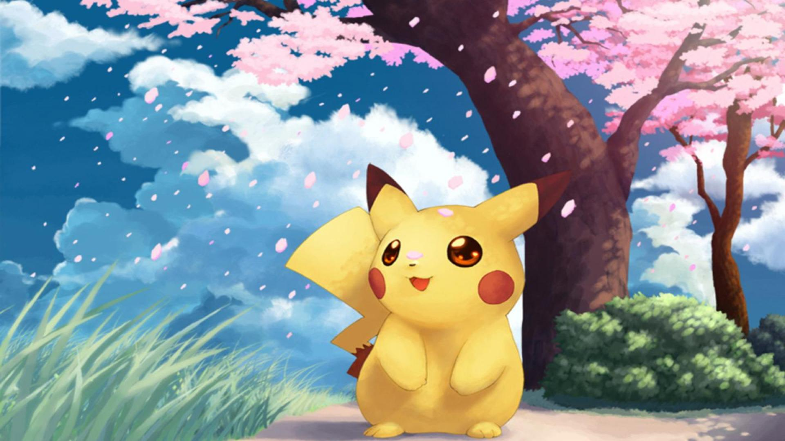
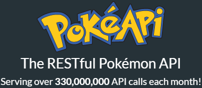

# PokeApi en _flutter_ :pokecoin:

En esta sección voy a mostrar como consumir la famosa API de pokemon en flutter



# **Pasos**

## Paso 1: Configuración del proyecto

- Crea un nuevo proyecto de Flutter utilizando el comando flutter create pokemon_app.
- Abre el archivo pubspec.yaml y agrega la dependencia de http bajo la sección dependencies:

```Dart
dependencies:
  http: ^0.13.3
```

Guarda los cambios y ejecuta el comando

```Dart
flutter pub get
```

> en la terminal para descargar la dependencia.

## Paso 2: Estructura de carpetas

1. Dentro del directorio lib, crea las siguientes carpetas: models, services, screens, y widgets.
1. La carpeta models contendrá las clases que representan los datos obtenidos de la API.
1. La carpeta services contendrá los archivos para realizar las llamadas a la API.
1. La carpeta screens contendrá las pantallas de la aplicación.
1. La carpeta widgets contendrá componentes reutilizables.

## Paso 3: Crear el modelo de Pokémon

1. Dentro de la carpeta models, crea un archivo llamado pokemon_model.dart.
1. En el archivo pokemon_model.dart, define la clase Pokemon que representará los datos de un Pokémon:

```Dart
class Pokemon {
  final String name;
  final String imageUrl;

  Pokemon({
    required this.name,
    required this.imageUrl,
  });
}
```

## Paso 4: Crear el servicio de la API

1. Dentro de la carpeta services, crea un archivo llamado api_service.dart.
1. En el archivo api_service.dart, importa los paquetes necesarios:

```Dart
import 'package:http/http.dart' as http;
import 'dart:convert';
```

Crea una clase llamada APIService que contendrá métodos para interactuar con la API:

```Dart
class APIService {
  static const baseUrl = 'https://pokeapi.co/api/v2';

  static Future<List<Pokemon>> fetchPokemons() async {
    final response = await http.get(Uri.parse('$baseUrl/pokemon'));
    if (response.statusCode == 200) {
      final data = jsonDecode(response.body);
      final results = data['results'] as List<dynamic>;
      final pokemons = results.map((result) {
        final name = result['name'];
        final url = result['url'];
        final id = url.split('/').last;
        final imageUrl = 'https://raw.githubusercontent.com/PokeAPI/sprites/master/sprites/pokemon/$id.png';
        return Pokemon(name: name, imageUrl: imageUrl);
      }).toList();
      return pokemons;
    } else {
      throw Exception('Failed to fetch pokemons');
    }
  }
}
```

## Paso 5: Crear la pantalla principal

1. Dentro de la carpeta screens, crea un archivo llamado home_screen.dart.
1. En el archivo home_screen.dart, importa los paquetes y archivos necesarios:

```Dart
import 'package:flutter/material.dart';
import '../models/pokemon_model.dart';
import '../services/api_service.dart';
```

Crea una clase llamada HomeScreen que será la pantalla principal de la aplicación:

```Dart
class HomeScreen extends StatefulWidget {
  @override
  _HomeScreenState createState() => _HomeScreenState();
}

class _HomeScreenState extends State<HomeScreen> {
  List<Pokemon> pokemons = [];

  @override
  void initState() {
    super.initState();
    fetchPokemons();
  }

  Future<void> fetchPokemons() async {
    try {
      final List<Pokemon> fetchedPokemons = await APIService.fetchPokemons();
      setState(() {
        pokemons = fetchedPokemons;
      });
    } catch (e) {
      print('Error: $e');
    }
  }

  @override
  Widget build(BuildContext context) {
    return Scaffold(
      appBar: AppBar(
        title: Text('Pokémon App'),
      ),
      body: ListView.builder(
        itemCount: pokemons.length,
        itemBuilder: (context, index) {
          final pokemon = pokemons[index];
          return ListTile(
            leading: Image.network(pokemon.imageUrl),
            title: Text(pokemon.name),
          );
        },
      ),
    );
  }
}
```

## Paso 6: Configurar la ruta de la pantalla principal

1. Abre el archivo lib/main.dart.
1. Actualiza la función main para configurar la ruta de la pantalla principal:

```Dart
import 'package:flutter/material.dart';
import 'screens/home_screen.dart';
```

```Dart
void main() {
  runApp(PokemonApp());
}

class PokemonApp extends StatelessWidget {
  @override
  Widget build(BuildContext context) {
    return MaterialApp(
      title: 'Pokémon App',
      theme: ThemeData(
        primarySwatch: Colors.blue,
      ),
      home: HomeScreen(),
    );
  }
}
```

## Paso 7: Ejecutar la aplicación

Guarda todos los archivos y ejecuta la aplicación utilizando el comando flutter run en la terminal.

**Para terminar**

Ahora deberías tener una aplicación de Flutter que consume la API de Pokémon y muestra la lista de nombres e imágenes de los Pokémon. Puedes personalizar y ampliar esta aplicación según tus necesidades, agregando más pantallas, detalles de Pokémon, etc. Recuerda seguir las buenas prácticas de Flutter y la organización de carpetas para mantener tu código limpio y fácil de mantener. ¡Espero que esto te ayude a comenzar con Flutter y la API de Pokémon!


